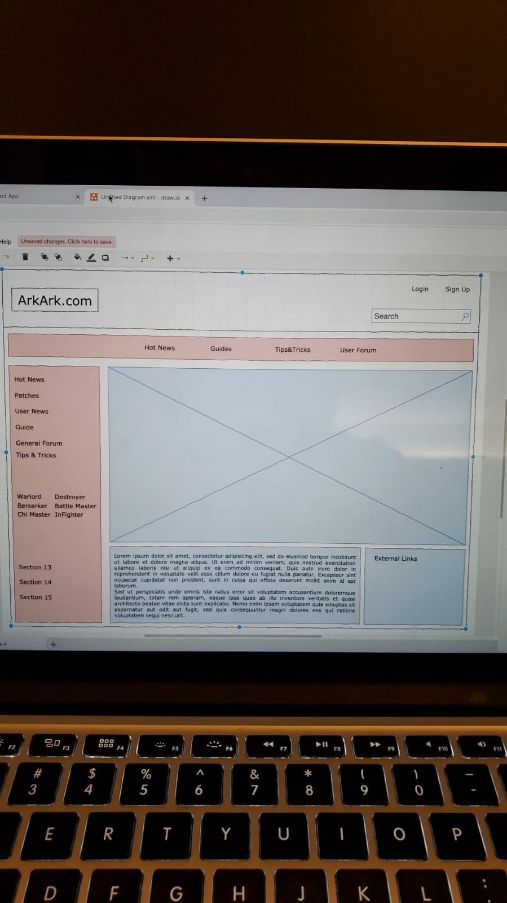
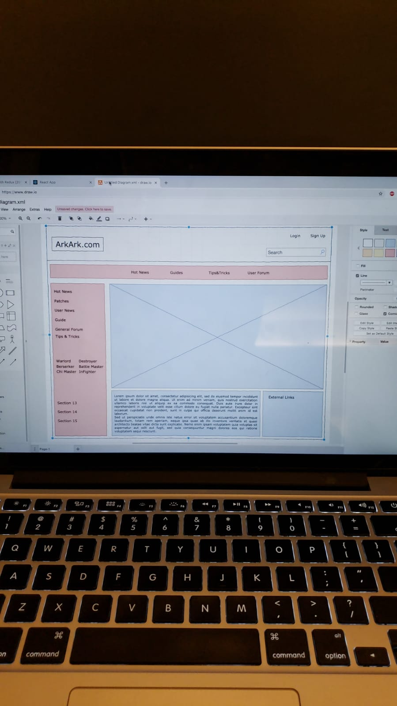

# README

This README would normally document whatever steps are necessary to get the
application up and running.

## Versions:
* Ruby version 2.5.3
* Rails version 5.2

## Installation:
1. Download Ruby v2.5.3 on [RubyInstaller.org](https://rubyinstaller.org/)
2. Install Rails by typing `gem install rails`
3. `bundle install`
4. Open the rails server `rails s -p 3001`
5. Go into the Frontend folder with `cd frontend`
6. `npm install`
7. `npm start` to start the server

* Database creation Postgresql
1. Go to [Postgresql.org](https://www.postgresql.org/download/windows/)
2. Download the latest
You can refer to [PostgresTutorial](http://www.postgresqltutorial.com/install-postgresql/)

3. If you have errors go to the downloaded file and right click > Send To > Desktop (shortcut)
4. Right click the shortcut on the desktop and go to properties
5. In the properties click on the Target and add `--install_runtimes 0` to the end of the file (there should be a space between them)
6. Install like normal and write down the password for superuser
7. Run PGAdmin
8. Go to Rails app > config > database.yml
9. `    development:
  database: LostArkYam_development
  username: postgres
  password: 
  host: localhost `
10. The above should be in there and uncommented. Below everything else should be commented

* Database initialization
1. In your rails app `bundle exec rake db:create`
2. `bundle exec rake db:seed` to seed the db with some data
3. `rails s -p 3001` to run server

* Deployment instructions
NONE

## Project Description:

* Wireframes for the site:

